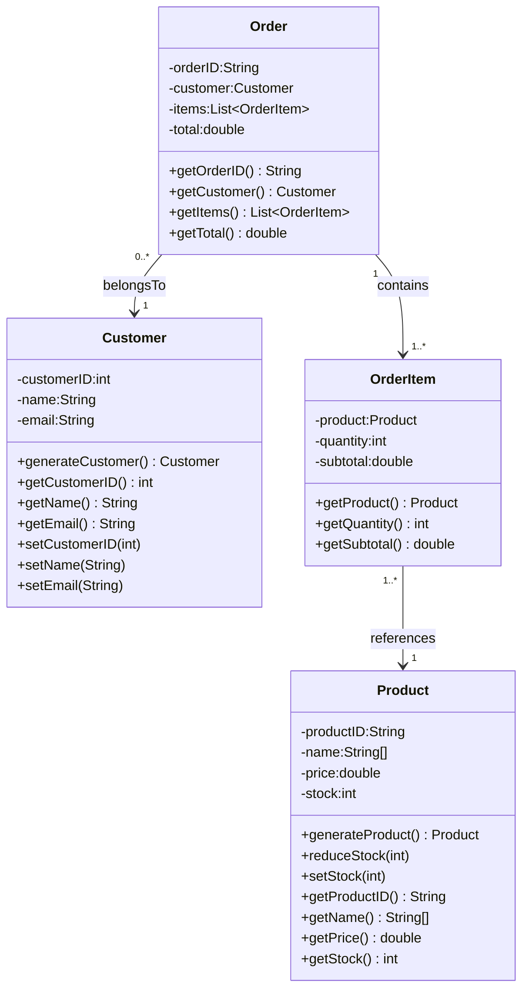

```mermaid
classDiagram
    class Customer {
        -customerID:int
        -name:String
        -email:String
        +generateCustomer() Customer
        +getCustomerID() int
        +getName() String
        +getEmail() String
        +setCustomerID(int)
        +setName(String)
        +setEmail(String)
    }

    class Product {
        -productID:String
        -name:String[]
        -price:double
        -stock:int
        +generateProduct() Product
        +reduceStock(int)
        +setStock(int)
        +getProductID() String
        +getName() String[]
        +getPrice() double
        +getStock() int
    }

    class Order {
        -orderID:String
        -customer:Customer
        -items:List~OrderItem~
        -total:double
        +getOrderID() String
        +getCustomer() Customer
        +getItems() List~OrderItem~
        +getTotal() double
    }
    
    class OrderItem {
        -product:Product
        -quantity:int
        -subtotal:double
        +getProduct() Product
        +getQuantity() int
        +getSubtotal() double
    }

    Order "0..*" --> "1" Customer : belongsTo
    Order "1" --> "1..*" OrderItem : contains
    OrderItem "1..*" --> "1" Product : references

```